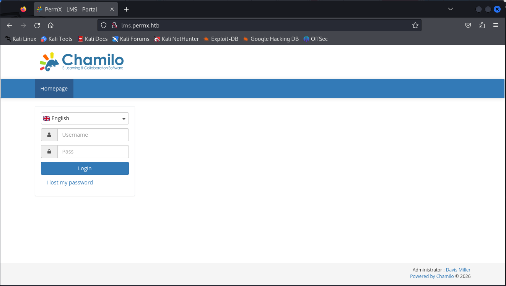

```bash
nmap -sS -p- -Pn -n --min-rate 5000 -vvv -oN iniScanPermx.txt 10.129.59.54
PORT   STATE SERVICE REASON
22/tcp open  ssh     syn-ack ttl 63
80/tcp open  http    syn-ack ttl 63
```

```bash
nmap -sCV -p22,80 -Pn -n -vvv -oN verScanPermx.txt 10.129.59.54
PORT   STATE SERVICE REASON         VERSION
22/tcp open  ssh     syn-ack ttl 63 OpenSSH 8.9p1 Ubuntu 3ubuntu0.10 (Ubuntu Linux; protocol 2.0)
| ssh-hostkey: 
|   256 e2:5c:5d:8c:47:3e:d8:72:f7:b4:80:03:49:86:6d:ef (ECDSA)
| ecdsa-sha2-nistp256 AAAAE2VjZHNhLXNoYTItbmlzdHAyNTYAAAAIbmlzdHAyNTYAAABBBAyYzjPGuVga97Y5vl5BajgMpjiGqUWp23U2DO9Kij5AhK3lyZFq/rroiDu7zYpMTCkFAk0fICBScfnuLHi6NOI=
|   256 1f:41:02:8e:6b:17:18:9c:a0:ac:54:23:e9:71:30:17 (ED25519)
|_ssh-ed25519 AAAAC3NzaC1lZDI1NTE5AAAAIP8A41tX6hHpQeDLNhKf2QuBM7kqwhIBXGZ4jiOsbYCI
80/tcp open  http    syn-ack ttl 63 Apache httpd 2.4.52
|_http-title: Did not follow redirect to http://permx.htb
|_http-server-header: Apache/2.4.52 (Ubuntu)
| http-methods: 
|_  Supported Methods: GET HEAD POST OPTIONS
Service Info: Host: 127.0.1.1; OS: Linux; CPE: cpe:/o:linux:linux_kernel
```

Añadimos permx.htb en /etc/hosts

```bash
whatweb permx.htb
http://permx.htb [200 OK] Apache[2.4.52], Bootstrap, Country[RESERVED][ZZ], Email[permx@htb.com], HTML5, HTTPServer[Ubuntu Linux][Apache/2.4.52 (Ubuntu)], IP[10.129.59.54], JQuery[3.4.1], Script, Title[eLEARNING]
```

http://permx.htb/


```bash
dirsearch -u http://permx.htb/
/usr/lib/python3/dist-packages/dirsearch/dirsearch.py:23: DeprecationWarning: pkg_resources is deprecated as an API. See https://setuptools.pypa.io/en/latest/pkg_resources.html
  from pkg_resources import DistributionNotFound, VersionConflict

  _|. _ _  _  _  _ _|_    v0.4.3
 (_||| _) (/_(_|| (_| )

Extensions: php, aspx, jsp, html, js | HTTP method: GET | Threads: 25 | Wordlist size: 11460

Output File: /home/fmol/htb/permx/nmap/reports/http_permx.htb/__26-01-27_14-32-28.txt

Target: http://permx.htb/

[14:32:28] Starting: 
[14:32:30] 403 -  274B  - /.ht_wsr.txt                                      
[14:32:31] 403 -  274B  - /.htaccess.bak1                                   
[14:32:31] 403 -  274B  - /.htaccess.orig                                   
[14:32:31] 403 -  274B  - /.htaccess.sample
[14:32:31] 403 -  274B  - /.htaccess.save
[14:32:31] 403 -  274B  - /.htaccess_extra                                  
[14:32:31] 403 -  274B  - /.htaccess_orig
[14:32:31] 403 -  274B  - /.htaccess_sc
[14:32:31] 403 -  274B  - /.htaccessBAK
[14:32:31] 403 -  274B  - /.htaccessOLD
[14:32:31] 403 -  274B  - /.htaccessOLD2
[14:32:31] 403 -  274B  - /.html                                            
[14:32:31] 403 -  274B  - /.htm                                             
[14:32:31] 403 -  274B  - /.htpasswds                                       
[14:32:31] 403 -  274B  - /.htpasswd_test
[14:32:31] 403 -  274B  - /.httr-oauth
[14:32:31] 301 -  303B  - /js  ->  http://permx.htb/js/                     
[14:32:31] 403 -  274B  - /.php                                             
[14:32:33] 200 -    3KB - /404.html                                         
[14:32:34] 200 -    4KB - /about.html                                       
[14:32:45] 200 -    3KB - /contact.html                                     
[14:32:46] 301 -  304B  - /css  ->  http://permx.htb/css/                   
[14:32:51] 301 -  304B  - /img  ->  http://permx.htb/img/                   
[14:32:53] 200 -  448B  - /js/                                              
[14:32:53] 200 -  491B  - /lib/                                             
[14:32:53] 301 -  304B  - /lib  ->  http://permx.htb/lib/                   
[14:32:55] 200 -  649B  - /LICENSE.txt                                      
[14:33:07] 403 -  274B  - /server-status                                    
[14:33:07] 403 -  274B  - /server-status/                                   
                                                                             
Task Completed
```


```bash
ffuf -c -fc 302,404 -t 200 -w /usr/share/wordlists/dirbuster/directory-list-2.3-medium.txt -u http://permx.htb/ -H "Host: FUZZ.permx.htb"                                                                      

        /'___\  /'___\           /'___\       
       /\ \__/ /\ \__/  __  __  /\ \__/       
       \ \ ,__\\ \ ,__\/\ \/\ \ \ \ ,__\      
        \ \ \_/ \ \ \_/\ \ \_\ \ \ \ \_/      
         \ \_\   \ \_\  \ \____/  \ \_\       
          \/_/    \/_/   \/___/    \/_/       

       v2.1.0-dev
________________________________________________

 :: Method           : GET
 :: URL              : http://permx.htb/
 :: Wordlist         : FUZZ: /usr/share/wordlists/dirbuster/directory-list-2.3-medium.txt
 :: Header           : Host: FUZZ.permx.htb
 :: Follow redirects : false
 :: Calibration      : false
 :: Timeout          : 10
 :: Threads          : 200
 :: Matcher          : Response status: 200-299,301,302,307,401,403,405,500
 :: Filter           : Response status: 302,404
________________________________________________

WWW                     [Status: 200, Size: 36182, Words: 12829, Lines: 587, Duration: 43ms]
www                     [Status: 200, Size: 36182, Words: 12829, Lines: 587, Duration: 7472ms]
Www                     [Status: 200, Size: 36182, Words: 12829, Lines: 587, Duration: 44ms]
lms                     [Status: 200, Size: 19347, Words: 4910, Lines: 353, Duration: 2176ms]
WwW                     [Status: 200, Size: 36182, Words: 12829, Lines: 587, Duration: 42ms]
:: Progress: [220560/220560] :: Job [1/1] :: 249 req/sec :: Duration: [0:01:09] :: Errors: 0 ::

```

Añadimos www.permx.htb y lms.permx.htb a /etc/hosts

```bash
whatweb http://lms.permx.htb/

http://lms.permx.htb/ [200 OK] Apache[2.4.52], Bootstrap, Chamilo[1], Cookies[GotoCourse,ch_sid], Country[RESERVED][ZZ], HTML5, HTTPServer[Ubuntu Linux][Apache/2.4.52 (Ubuntu)], HttpOnly[GotoCourse,ch_sid], IP[10.129.59.54], JQuery, MetaGenerator[Chamilo 1], Modernizr, PasswordField[password], PoweredBy[Chamilo], Script, Title[PermX - LMS - Portal], X-Powered-By[Chamilo 1], X-UA-Compatible[IE=edge]
```

http://lms.permx.htb/




```bash
dirsearch -u http://lms.permx.htb/
/usr/lib/python3/dist-packages/dirsearch/dirsearch.py:23: DeprecationWarning: pkg_resources is deprecated as an API. See https://setuptools.pypa.io/en/latest/pkg_resources.html
  from pkg_resources import DistributionNotFound, VersionConflict

  _|. _ _  _  _  _ _|_    v0.4.3
 (_||| _) (/_(_|| (_| )

Extensions: php, aspx, jsp, html, js | HTTP method: GET | Threads: 25 | Wordlist size: 11460

Output File: /home/fmol/htb/permx/nmap/reports/http_lms.permx.htb/__26-01-27_14-54-33.txt

Target: http://lms.permx.htb/

[14:54:33] Starting: 
[14:54:34] 200 -   46B  - /.bowerrc                                         
[14:54:34] 200 -    2KB - /.codeclimate.yml                                 
[14:54:35] 403 -  278B  - /.ht_wsr.txt                                      
[14:54:35] 403 -  278B  - /.htaccess.bak1                                   
[14:54:35] 403 -  278B  - /.htaccess.save                                   
[14:54:35] 403 -  278B  - /.htaccess.orig
[14:54:35] 403 -  278B  - /.htaccess.sample
[14:54:35] 403 -  278B  - /.htaccess_orig                                   
[14:54:35] 403 -  278B  - /.htaccess_extra
[14:54:35] 403 -  278B  - /.htaccess_sc
[14:54:35] 403 -  278B  - /.htaccessBAK
[14:54:35] 403 -  278B  - /.htaccessOLD
[14:54:35] 403 -  278B  - /.htaccessOLD2
[14:54:35] 403 -  278B  - /.html                                            
[14:54:35] 403 -  278B  - /.htm                                             
[14:54:35] 403 -  278B  - /.htpasswd_test                                   
[14:54:35] 403 -  278B  - /.htpasswds
[14:54:35] 403 -  278B  - /.httr-oauth                                      
[14:54:38] 403 -  278B  - /.php                                             
[14:54:38] 200 -    3KB - /.scrutinizer.yml                                 
[14:54:39] 200 -    4KB - /.travis.yml                                      
[14:54:50] 200 -  708B  - /app/                                             
[14:54:50] 200 -  540B  - /app/cache/                                       
[14:54:50] 301 -  312B  - /app  ->  http://lms.permx.htb/app/               
[14:54:51] 200 -  407B  - /app/logs/                                        
[14:54:51] 200 -  101KB - /app/bootstrap.php.cache                          
[14:54:52] 301 -  312B  - /bin  ->  http://lms.permx.htb/bin/               
[14:54:52] 200 -  455B  - /bin/                                             
[14:54:53] 200 -    1KB - /bower.json                                       
[14:54:55] 200 -    7KB - /composer.json                                    
[14:54:55] 200 -    5KB - /CONTRIBUTING.md                                  
[14:54:56] 200 -  587KB - /composer.lock                                    
[14:54:57] 301 -  322B  - /documentation  ->  http://lms.permx.htb/documentation/
[14:54:57] 200 -    1KB - /documentation/                                   
[14:54:58] 200 -    2KB - /favicon.ico                                      
[14:55:01] 200 -    4KB - /index.php                                        
[14:55:01] 200 -    4KB - /index.php/login/                                 
[14:55:05] 200 -  842B  - /license.txt                                      
[14:55:05] 200 -   34KB - /LICENSE                                          
[14:55:06] 301 -  313B  - /main  ->  http://lms.permx.htb/main/             
[14:55:06] 200 -   97B  - /main/
[14:55:14] 200 -    8KB - /README.md                                        
[14:55:14] 200 -  403B  - /robots.txt                                       
[14:55:15] 403 -  278B  - /server-status/                                   
[14:55:15] 403 -  278B  - /server-status                                    
[14:55:18] 200 -  444B  - /src/                                             
[14:55:18] 301 -  312B  - /src  ->  http://lms.permx.htb/src/               
[14:55:22] 302 -    0B  - /user.php  ->  whoisonline.php                    
[14:55:22] 200 -    0B  - /vendor/autoload.php                              
[14:55:22] 200 -    0B  - /vendor/composer/autoload_real.php                
[14:55:22] 200 -    0B  - /vendor/composer/autoload_files.php
[14:55:22] 200 -    0B  - /vendor/composer/autoload_namespaces.php          
[14:55:22] 200 -    0B  - /vendor/composer/ClassLoader.php
[14:55:22] 200 -    0B  - /vendor/composer/autoload_psr4.php
[14:55:22] 200 -    1KB - /vendor/composer/LICENSE
[14:55:22] 200 -    0B  - /vendor/composer/autoload_static.php              
[14:55:22] 200 -    1KB - /vendor/                                          
[14:55:23] 200 -    0B  - /vendor/composer/autoload_classmap.php            
[14:55:23] 200 -  531KB - /vendor/composer/installed.json                   
[14:55:26] 200 -    6KB - /web.config                                       
[14:55:26] 200 -  479B  - /web/                                             
                                                                             
Task Completed                                   
```

http://lms.permx.htb//README.md
```
# Chamilo 1.11.x
<SNIP>
```

https://www.incibe.es/incibe-cert/alerta-temprana/vulnerabilidades/cve-2023-4220

https://github.com/oxapavan/CVE-2023-4220-HTB-PermX
https://github.com/oxapavan/CVE-2023-4220-HTB-PermX/blob/main/script.sh

